# Python CRUD Object (using PrettyTable, using Multilevel Inheritance)  
### python v3.7.3  

# Operations  

* Create - add a single row in the object  
* Read - display all rows in the object    
* Update - update a single row in the object     
* Delete - delete a single row in the object   
  
# Config  
`pip install PrettyTable`  
  
# Usage  
```
python harwdware.py  
```  
```
python products.py  
```  
```
python color.py  
```

## Hardware and Software UI  
### View 1 - UI  
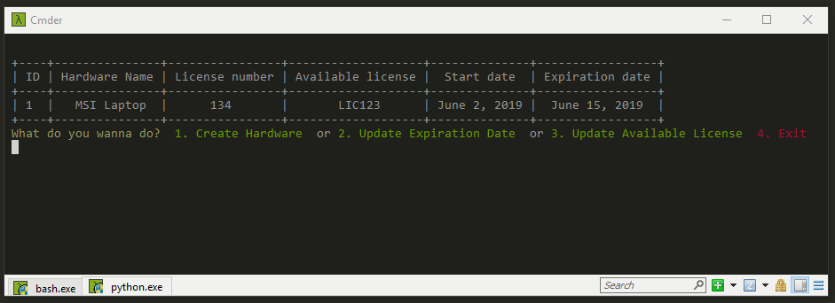  

### View 2 - Read  
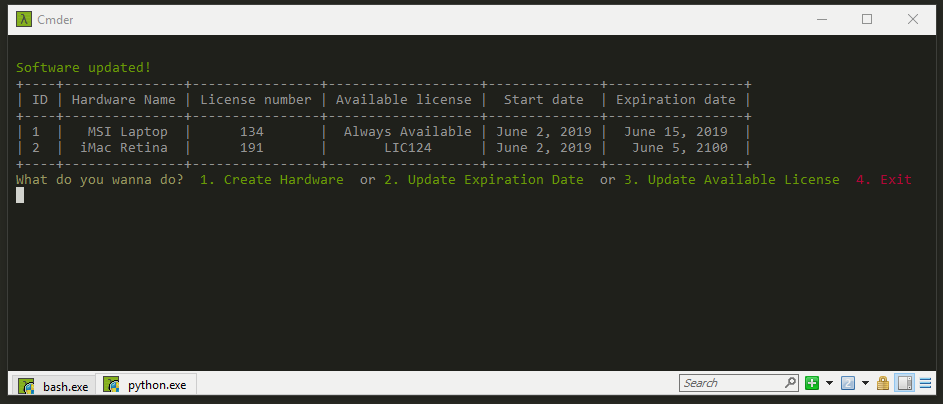 

### View 3 - Create  
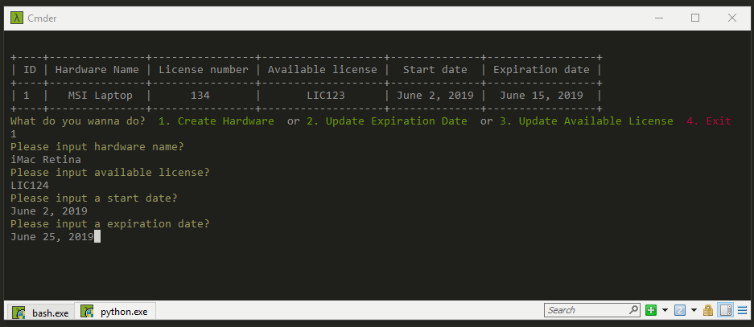  

### View 4 - Update Available License  
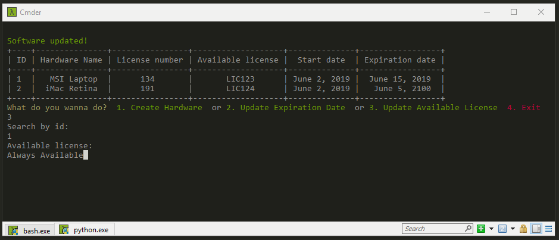

### View 5 - Update Expiration License  
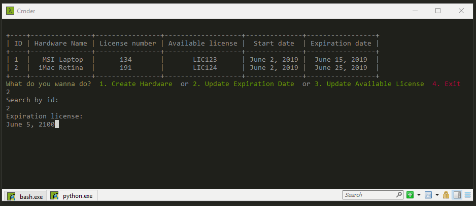  

### View 6 - Exit   
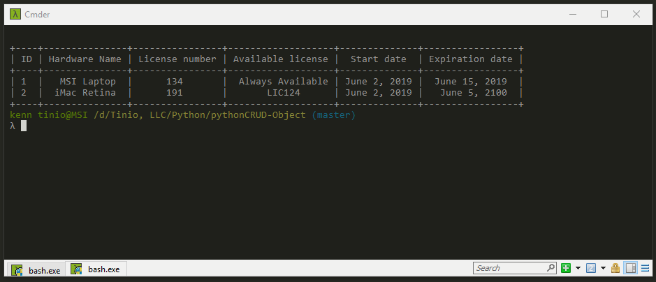  

## Products UI  
### View 1 - Running python.py  
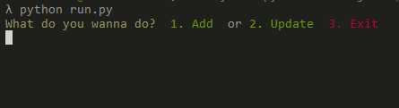  

### View 2 - Create a product    
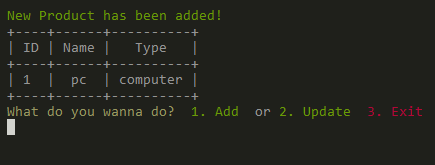 

### View 3 - Create a product 
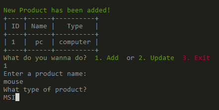 

### View 4 - Update - search by id 
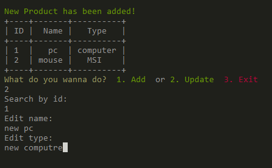 

### View 5 - Product successfully added  
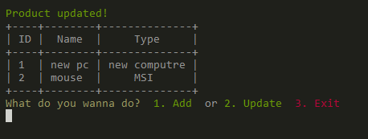 

### View 6 - Delete a product  
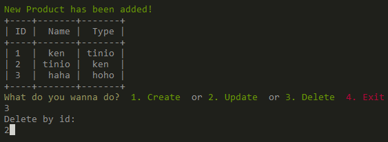 

### View 7 - After Deleting  
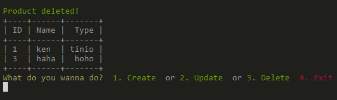 

### View 8 - Exit  
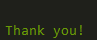 

Documentation for PrettyTable  
[PrettyTable](http://zetcode.com/python/prettytable/)    
  
Documentation for Styling  
[Colors](http://ozzmaker.com/add-colour-to-text-in-python/)    
